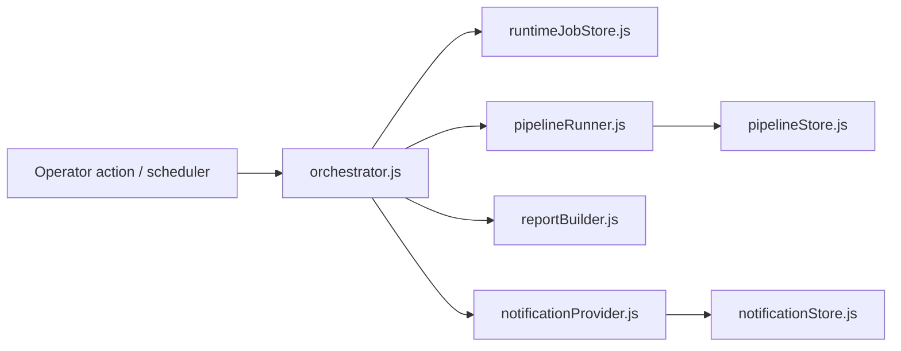
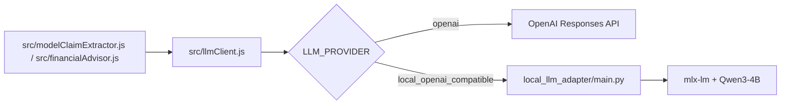

# X Ticker Investment

Explainable multi-day investment recommendations built from a curated list of X accounts, clustered into higher-level events, and translated into `BUY`, `HOLD`, or `SELL` calls for a narrow AI/tech asset universe.

## What is included

- A polished single-page web app with:
  - signal dashboard
  - asset detail view
  - source registry view
  - placeholder simulation / decision log page
- Seeded product data for sources, posts, event clusters, vetoes, and decisions
- A dependency-light local Node server
- Local JSON API endpoints that power the frontend snapshot
- A persisted fake tweet store with 140 analysed tweets until the real X API arrives
- A persisted source store and operator CRUD workflow for monitored sources
- A first server-side agent engine that computes claim extraction, runtime clustering, policy vetoes, and the decision book from the fetched feed
- A model-backed claim-extraction layer with persistent caching and automatic heuristic fallback when no OpenAI key is configured
- A persisted pipeline runner that stores ingestion snapshots, market context, clusters, decisions, and decision history
- An offline extraction eval harness with prompt-versioned regression history and scenario-level cluster / decision checks
- A run-history UI for replaying stored pipeline runs and eval runs inside the app
- SQLite-backed persistence for sources, tweets, extraction cache, pipeline runs, and eval runs
- A background pipeline scheduler so the engine can refresh without manual clicks
- A lightweight orchestrator runtime that records pipeline/report jobs and routes notifications
- Optional Telegram notifications for pipeline alerts, digests, and runtime test messages
- A persisted financial profile store for holdings, liabilities, liquidity, and investor goals
- A guided onboarding wizard for building the initial financial profile, including funds, ETFs, pension/insurance products, liabilities, and contract checklists
- A portfolio-aware advisor workflow for asking explicit asset questions against the latest snapshot
- A market-data provider adapter that can use Stooq daily data without keys and fall back to mock data automatically
- Decision outcome tracking that records reference prices and updates later run outcomes over time

## Run locally

```bash
npm start
```

Then open [http://127.0.0.1:3000](http://127.0.0.1:3000).

An example environment file is available at `.env.example`.
If you create a local `.env`, the npm scripts will load it automatically.

Useful local commands:

```bash
npm run pipeline
npm run evals
npm run evals:strict
```

- `npm run pipeline`: rebuild and persist the latest engine snapshot
- `npm run evals`: execute the offline extraction eval suite and persist the result
- `npm run evals:strict`: execute the eval suite and fail the command if a regression gate is missed
- The eval suite now covers both post-level extraction fixtures and scenario-level cluster / decision outcomes.

## Optional model extraction

The engine now supports an OpenAI-backed claim extractor. If `OPENAI_API_KEY` is not set, the app automatically falls back to the built-in heuristic extractor and keeps working.

Optional environment variables:

- `OPENAI_API_KEY`: enables the model-backed extractor
- `OPENAI_MODEL`: override the default extraction model (`gpt-4.1-mini`)
- `CLAIM_EXTRACTION_MODE`: `auto` (default), `openai`, or `heuristic`
- `OPENAI_BASE_URL`: override the OpenAI API base URL if needed
- `NOTIFICATION_PROVIDER`: set to `telegram` to enable Telegram delivery
- `NOTIFICATIONS_ENABLED`: set to `1` to turn on the notification router
- `TELEGRAM_BOT_TOKEN`: Telegram Bot API token
- `TELEGRAM_CHAT_ID`: destination chat id for alerts and digests
- `TELEGRAM_API_BASE_URL`: override the Telegram Bot API base URL if needed
- `LLM_PROVIDER`: `openai` (default) or `local_openai_compatible`
- `LOCAL_LLM_BASE_URL`: base URL for a local OpenAI-compatible Responses API
- `LOCAL_LLM_API_KEY`: optional token for the local adapter (defaults to `local-dev-token`)
- `LOCAL_LLM_MODEL`: local model id exposed by the adapter
- `FINANCIAL_ADVISOR_MODEL`: override the default advisor model (`gpt-4.1-mini`)

The extraction cache is persisted in `data/extraction-cache.json` so already-processed tweets are not re-sent on every refresh.

## Pipeline and evals

The app no longer computes the full engine state only at request time.

- The persisted SQLite database lives in `data/x-ticker.sqlite`
- Each pipeline run records:
  - raw-ingestion summary and dedupe stats
  - source watermarks
  - market-context enrichment from the active market provider
  - extracted claims, clusters, decisions, and vetoes
  - decision history entries for the logs page
  - ongoing outcome fields like latest price, return since decision, and 1d/3d/7d checkpoints when available
- Each eval run records:
  - extractor mode
  - prompt version
  - average score and exact match rate
  - field-level accuracy
  - failed cases for quick regression review
  - regression gate pass/fail state

### Runtime architecture



Background execution:

- `PIPELINE_INTERVAL_MINUTES`: how often the server should rerun the pipeline in the background
- Set it to `0` to disable the background scheduler
- Use `POST /api/admin/runtime/pause` and `POST /api/admin/runtime/resume` for manual scheduler control

Market provider configuration:

- `MARKET_DATA_PROVIDER`: `auto` (default), `stooq`, or `mock`
- `MARKET_DATA_TIMEOUT_MS`: request timeout for the Stooq adapter

Feed provider configuration:

- `FEED_PROVIDER`: `fake` (default) or `x-api`
- `X_API_BEARER_TOKEN` / `X_API_KEY`: reserved for the future live X adapter

## Local API

- `GET /api/health`
- `GET /api/app-data`
- `GET /api/analysed-posts?days=3&limit=100`
- `GET /api/tweet-store/status`
- `GET /api/pipeline/runs`
- `GET /api/pipeline/runs/:id`
- `GET /api/evals/history`
- `GET /api/evals/history/:id`
- `GET /api/runtime/status`
- `GET /api/operator/profile`
- `PUT /api/operator/profile`
- `GET /api/advisor/history`
- `POST /api/advisor/ask`
- `GET /api/engine/extraction-replay?postId=<id>&live=1`
- `POST /api/admin/run-pipeline`
- `POST /api/admin/run-evals`
- `POST /api/admin/reseed-fake-tweets`
- `POST /api/admin/runtime/pause`
- `POST /api/admin/runtime/resume`
- `POST /api/admin/runtime/send-digest`
- `POST /api/admin/runtime/test-notification`
- `GET /api/operator/sources`
- `POST /api/operator/sources`
- `PUT /api/operator/sources/:id`
- `DELETE /api/operator/sources/:id`

`/api/engine/extraction-replay` is a single-post debugging endpoint that exposes:

- the exact request envelope that would be sent to the model
- the extraction cache fingerprint and cached payload, if present
- the heuristic baseline
- the current normalized snapshot output
- the active prompt guide, validation focus, and embedded calibration examples
- an optional one-off live model run when `live=1` and `OPENAI_API_KEY` is configured

## Files

- `index.html` bootstraps the app
- `src/data.js` contains the seeded domain model and API snapshot builder
- `src/agenticEngine.js` computes the current claim, cluster, veto, and decision state from fetched tweets
- `src/modelClaimExtractor.js` handles the OpenAI structured-output extraction path with heuristic fallback
- `src/extractionCacheStore.js` persists model extraction results by tweet fingerprint
- `src/fakeTweetGenerator.js` generates the deterministic fake tweet feed
- `src/tweetStore.js` persists and serves the local tweet store
- `src/sourceStore.js` persists and serves the source registry
- `src/ingestionPipeline.js` defines the raw-post and normalized-post ingestion contracts
- `src/database.js` owns the SQLite schema and shared DB helpers
- `src/feedProvider.js` defines the fake-feed and future X-ingestion adapter contract
- `src/marketDataProvider.js` provides the market-data adapter with Stooq + mock fallback
- `src/pipelineRunner.js` executes and persists the full pipeline
- `src/backgroundPipelineRunner.js` schedules recurring pipeline refreshes while the server is running
- `src/orchestrator.js` coordinates runtime jobs, pipeline refreshes, and digest notifications
- `src/llmClient.js` centralizes Responses API calls so hosted OpenAI and local OpenAI-compatible servers share one path
- `src/financialProfileStore.js` persists the operator financial profile
- `src/financialAdvisor.js` answers explicit asset questions using the financial profile plus the latest snapshot
- `src/advisorStore.js` stores advisor answers for replay in the UI
- `src/runtimeJobStore.js` persists runtime job history
- `src/notificationProvider.js` routes alert delivery and supports Telegram via env vars
- `src/notificationStore.js` persists notification event history
- `src/reportBuilder.js` formats digest and alert payloads for operator delivery
- `src/pipelineStore.js` stores pipeline snapshots and decision history
- `src/evalHarness.js` runs the offline extraction regression suite
- `src/evalStore.js` stores eval history
- `src/app.js` fetches the persisted snapshot and renders the dashboard, operator runtime, extraction replay inspector, and run-history views
- `src/styles.css` defines the visual system and responsive layout
- `server.js` serves the app and exposes the local API without external dependencies
- `data/tweet-store.json` is the local persisted fake feed created on first run
- `data/source-store.json` is the local persisted source registry created on first run
- `data/extraction-cache.json` is the local model-extraction cache created on first model-backed run
- `data/pipeline-store.json` is the persisted pipeline snapshot and decision-history store
- `data/eval-history.json` is the persisted eval-history store
- `data/eval-suite.json` is the local regression fixture set for extraction testing
- `data/x-ticker.sqlite` is the new primary persistence layer; the JSON files are now legacy migration inputs / compatibility artifacts

## Local Qwen on a Mac Mini

See `docs/local-qwen-macmini.md` for the recommended Apple-silicon path:

- `mlx-lm` for local inference
- `local_llm_adapter/main.py` as a minimal OpenAI-compatible Responses adapter
- `scripts/start-local-qwen-adapter.sh` to launch the adapter locally


