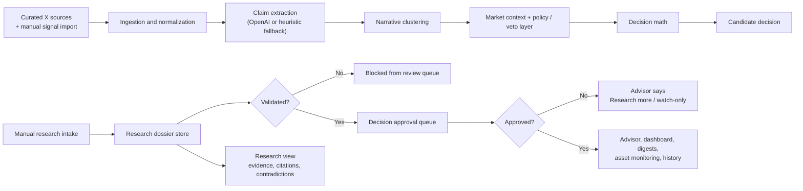
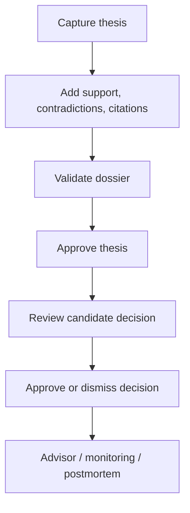
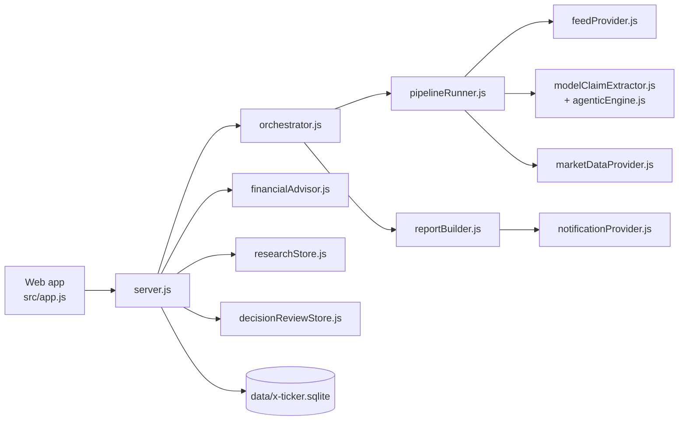

# X Ticker Investment

Research-first, explainable investment decision support built around a narrow tech and AI asset universe.

The product watches a curated set of X accounts, extracts structured claims, clusters them into narratives, enriches them with market context, and turns them into conservative `BUY` / `HOLD` / `SELL` candidates. Those candidates are not treated as investable by default: they now sit behind a research dossier lifecycle, explicit decision math, and an operator approval layer.

## What This Repo Is

- A local-first web app for one operator
- A bounded agentic pipeline, not an autonomous trading bot
- A research and governance workflow for turning noisy social signals into auditable candidate decisions
- A portfolio-aware advisor that uses the latest snapshot plus the saved financial profile
- A personal watched universe that automatically folds saved holdings and watchlist names into soft impact ranking
- A replayable runtime with persisted runs, evals, review state, and operator-facing history

## Product Model

The current product is built around five ideas:

1. Research comes before action.
   A thesis can be captured quickly, but it cannot become action-ready until it has enough evidence to be validated and approved.
2. AI interprets, deterministic policy decides.
   Models help extract and normalize claims, but the pipeline still uses explicit rules, vetoes, and lifecycle gates.
3. Decision math must be visible.
   Each actionable candidate carries thesis probability, expected upside/downside, reward-to-risk, size band, and a max-loss guardrail.
4. Operator review is mandatory.
   Even after validation, decisions enter an approval queue instead of becoming silently “live.”
5. Advice must respect governance.
   The advisor falls back to `Research more` or watch-only language when research, thesis approval, or decision approval is incomplete.

## AI Agentic Flow

This is the main end-to-end flow that now powers the product:



## Operator Workflow

The user-facing workflow is intentionally stricter than the raw model pipeline:



## Main Surfaces

- `Overview`
  Portfolio-first briefing, queue visibility, research-first callouts, and current signals
- `Research`
  Dossier intake, editing, lifecycle actions, scorecards, and evidence traceability
- `Signals`
  Manual feed import plus recent normalized posts, strict mapped assets, and separate likely-impact ranking that elevates saved holdings/watchlist names
- `Tests`
  An ad hoc single-tweet lab that shows the extractor request, cache/live model behavior, normalized output, and likely impacts without polluting the live feed
- `Assets`
  Decision summary, linked research, operator review controls, and a watched universe that blends the curated list with your saved portfolio/watchlist
- `Advisor`
  Portfolio-aware asset questions grounded in the latest snapshot and governance state
- `Operations`
  Pipeline runs, evals, source registry, replay tools, scheduler, and notifications

## Runtime Architecture



## Governance Guarantees

- Research dossiers use a canonical lifecycle:
  `discovery -> candidate -> validated -> approved / dismissed / expired / archived`
- A dossier cannot be validated or approved without thesis, assets, horizon, supporting evidence, contradicting evidence, and citations
- The review queue only surfaces decisions linked to validated or approved dossiers
- The app shows the same lifecycle state across Research, Overview, Assets, Advisor, and `/api/app-data`
- The advisor uses governance state, not just model confidence
- All core state is persisted locally for replay and audit

## Staged Rollout

- Stage 1: Research desk mode
  Run the app as a supervised research surface. Treat `Broad inference`, `Mixed mapping`, and `Cluster inference` labels as context only until an operator reads the underlying post.
- Stage 2: Assisted approval mode
  Let the agentic pipeline draft queue items and advisor answers, but keep operator approval mandatory for every decision and for any signal with weak asset mapping.
- Stage 3: Bounded production mode
  Use hosted reasoning only after the model and prompt keep clearing your eval bar, keep research approval and queue approval in place, and review weak-mapping rates alongside approve/dismiss outcomes before expanding trust.

## Run Locally

```bash
npm start
```

Then open [http://127.0.0.1:3000](http://127.0.0.1:3000).

Useful commands:

```bash
npm run pipeline
npm run evals
npm run evals:strict
```

- `npm run pipeline`
  Rebuilds the latest persisted snapshot
- `npm run evals`
  Runs the offline extraction and scenario eval suite
- `npm run evals:strict`
  Runs evals and fails if the regression gate is missed

The primary persisted store is [data/x-ticker.sqlite](/Users/wassimboubaker/x-ticker-investment/data/x-ticker.sqlite).

## Configuration Overview

An example environment file is available at `.env.example`.

The most important knobs are:

- Feed and ingestion
  `FEED_PROVIDER`, `X_API_BEARER_TOKEN`, `X_API_BASE_URL`
- Extraction
  `CLAIM_EXTRACTION_MODE`, `OPENAI_API_KEY`, `OPENAI_MODEL`, `OPENAI_BASE_URL`
- Market enrichment
  `MARKET_DATA_PROVIDER`, `MARKET_DATA_TIMEOUT_MS`
- Scheduler
  `PIPELINE_SCHEDULE_TIMES`, `PIPELINE_SCHEDULE_TIMEZONE`, `PIPELINE_INTERVAL_MINUTES`, `MANUAL_FEED_CRON_INTERVAL_HOURS`, `MANUAL_FEED_CRON_MAX_POST_AGE_HOURS`
- Notifications
  `NOTIFICATION_PROVIDER`, `NOTIFICATIONS_ENABLED`, `TELEGRAM_BOT_TOKEN`, `TELEGRAM_CHAT_ID`, `TELEGRAM_COMMANDS_ENABLED`
- Local / hosted LLM routing
  `LLM_PROVIDER`, `LOCAL_LLM_BASE_URL`, `LOCAL_LLM_API_KEY`, `LOCAL_LLM_MODEL`, `FINANCIAL_ADVISOR_MODEL`

If no OpenAI key is configured, extraction and advice still work through conservative fallback paths.

Example exact-time scheduler config for Berlin:

```bash
PIPELINE_SCHEDULE_TIMES=06:00,11:59,16:00,22:00
PIPELINE_SCHEDULE_TIMEZONE=Europe/Berlin
```

If `PIPELINE_SCHEDULE_TIMES` is empty, the app falls back to `PIPELINE_INTERVAL_MINUTES`.

## Telegram Bot Commands

The runtime can answer a small set of Telegram bot commands through long polling, so you do not need to expose a public webhook for local use. The same bot can also act as a manual signal inbox when you want to paste posts yourself instead of relying on the X API.

Enable it with:

```bash
NOTIFICATION_PROVIDER=telegram
NOTIFICATIONS_ENABLED=1
TELEGRAM_BOT_TOKEN=<your-bot-token>
TELEGRAM_CHAT_ID=<your-chat-id>
TELEGRAM_COMMANDS_ENABLED=1
```

Optional knobs:

- `TELEGRAM_ALLOWED_CHAT_ID`
  Restricts commands to one chat. If empty, it falls back to `TELEGRAM_CHAT_ID`.
- `TELEGRAM_POLLING_TIMEOUT_SECONDS`
  Long-poll timeout for `getUpdates`. Default is `30`.

Supported commands:

- `/start`
  Shows what the bot does
- `/help`
  Lists the available commands
- `/status`
  Returns the latest pipeline, scheduler, and approval-queue status
- `/digest`
  Sends the latest operator digest into the chat
- `/ingest`
  Queues pasted posts into the manual feed without processing them immediately
- `/process`
  Processes queued manual posts that are still within the active 24-hour window

The command runner is active only while the local server is running.

If you want Telegram to be the primary feed path instead of X sync:

```bash
FEED_PROVIDER=manual
PIPELINE_SCHEDULE_TIMES=
PIPELINE_INTERVAL_MINUTES=0
```

Use `/ingest append` to keep building the feed over time, or `/ingest replace` to replace the current manual feed. Each pasted block should start with the original poster handle:

```text
/ingest append
@semiflow: Broadening risk appetite keeps semis bid; still constructive on NVDA.

2026-03-24T11:45:00Z | @btcwatch: BTC positioning still looks louder than spot demand.
```

Separate multiple posts with a blank line. The bot will create missing sources automatically and queue the posts in the existing manual feed. Use `/process` when you want to batch-run the queue immediately.

When the saved feed is manual, a separate backlog sweep also runs every 6 hours by default. It only looks at manual posts that are still unprocessed and not older than 24 hours. You can tune that with:

```bash
MANUAL_FEED_CRON_INTERVAL_HOURS=6
MANUAL_FEED_CRON_MAX_POST_AGE_HOURS=24
```

## Local API

The app is driven by a small local JSON API.

Core reads:

- `GET /api/health`
- `GET /api/app-data`
- `GET /api/analysed-posts?days=3&limit=100`
- `GET /api/pipeline/runs`
- `GET /api/evals/history`

Operator workflows:

- `GET /api/operator/profile`
- `PUT /api/operator/profile`
- `GET /api/operator/research`
- `POST /api/operator/research`
- `GET /api/operator/research/:id`
- `PUT /api/operator/research/:id`
- `DELETE /api/operator/research/:id`
- `GET /api/operator/decision-reviews`
- `PUT /api/operator/decision-reviews/:id`
- `POST /api/operator/manual-feed/import`
- `GET /api/operator/sources`
- `POST /api/operator/sources`
- `PUT /api/operator/sources/:id`
- `DELETE /api/operator/sources/:id`

Advisor and debugging:

- `GET /api/advisor/history`
- `POST /api/advisor/ask`
- `GET /api/engine/extraction-replay?postId=<id>&live=1`

Admin / runtime:

- `POST /api/admin/run-pipeline`
- `POST /api/admin/run-evals`
- `POST /api/admin/reseed-fake-tweets`
- `POST /api/admin/runtime/pause`
- `POST /api/admin/runtime/resume`
- `POST /api/admin/runtime/send-digest`
- `POST /api/admin/runtime/test-notification`

## Repo Map

Core code:

- [server.js](/Users/wassimboubaker/x-ticker-investment/server.js)
  Local web server and JSON API
- [src/agenticEngine.js](/Users/wassimboubaker/x-ticker-investment/src/agenticEngine.js)
  Claim interpretation, clustering, policy, and decision math
- [src/researchStore.js](/Users/wassimboubaker/x-ticker-investment/src/researchStore.js)
  Research dossier lifecycle, validation rules, scorecards, and dashboard state
- [src/decisionReviewStore.js](/Users/wassimboubaker/x-ticker-investment/src/decisionReviewStore.js)
  Current review queue persistence and carry-forward logic
- [src/financialAdvisor.js](/Users/wassimboubaker/x-ticker-investment/src/financialAdvisor.js)
  Portfolio-aware advisor with governance-aware fallback behavior
- [src/pipelineRunner.js](/Users/wassimboubaker/x-ticker-investment/src/pipelineRunner.js)
  Persisted pipeline execution
- [src/app.js](/Users/wassimboubaker/x-ticker-investment/src/app.js)
  Frontend app and operator flows
- [src/database.js](/Users/wassimboubaker/x-ticker-investment/src/database.js)
  Shared SQLite schema and DB helpers

Supporting runtime:

- [src/orchestrator.js](/Users/wassimboubaker/x-ticker-investment/src/orchestrator.js)
- [src/reportBuilder.js](/Users/wassimboubaker/x-ticker-investment/src/reportBuilder.js)
- [src/notificationProvider.js](/Users/wassimboubaker/x-ticker-investment/src/notificationProvider.js)
- [src/modelClaimExtractor.js](/Users/wassimboubaker/x-ticker-investment/src/modelClaimExtractor.js)
- [src/marketDataProvider.js](/Users/wassimboubaker/x-ticker-investment/src/marketDataProvider.js)

## Updates

### 2026-04-03

**UI / UX redesign** — simplified navigation and header

- Navigation restructured from 5 tabs to 4: **Today**, **Feed**, **Research**, **Decisions**
- Research promoted from a hidden sub-view inside Decisions to a first-class top-level tab
- Portfolio / Setup moved to a small ⚙ gear icon in the header — it is a one-time config, not a daily destination
- Advisor accessible from the Decisions tab and the Today attention checklist
- Header compacted: brand copy paragraph removed, four meta pills collapsed to a single status line (`Updated N ago · feed mode · N pending`)
- Developer tools moved to a subtle footer link, away from the main interaction zone
- Dashboard (Today) simplified: hero panel with tagline cards removed, replaced by a 3-step onboarding prompt for first-time users; Research and Advisor bottom sections removed (they now live in their own tabs)
- Feed item card padding reduced for better visual density

**Decision card enrichment** — more context at the point of review

Each decision card in the approval queue now shows:
- **Corroboration badge** (top-right): how many independent sources back the signal — 1 source (amber), 2 (neutral), 3+ (green)
- **Counter** block: the first item from `whyNot[]` — the strongest reason the call might be wrong
- **Signal evidence** block: up to 2 verbatim post snippets (handle, timestamp, 140-char body) — what actually drove the decision
- **Watch** block (when present): the primary uncertainty from `uncertainty[]`
- **Horizon** added to the chip row
- **Ask Advisor** button on every card, linking directly to the Advisor tab
- Fixed: the "Open Research" link in the decision gate now correctly navigates to the Research tab

**Noise gates** — fewer, better decisions in the queue

- *Actionability floor*: commentary posts, neutral-direction posts, and policy-noise cluster posts (all flagged `actionable: false` by the engine) no longer flow into decision clusters. Previously they passed through because `blocksActionability` is only raised for posts that are actionable but lack corroboration.
- *Zero-post guard*: if no eligible, actionable posts are mapped to an asset in the current window, no candidate decision is generated for it. Previously the engine produced a decision for every monitored asset on every run regardless of whether there was any signal basis.

---

## Roadmap / Wishlist

Features prioritised by impact on financial quality and decision confidence. None are live yet.

### High priority

**Outcome attribution**
Lock the market price at the moment a decision is approved. After the decision's horizon passes, fetch the resolved price and compute return. Surface win rate by asset, by cluster, and by source tier. Without this, there is no objective feedback loop on whether the system generates any alpha.

**Macro regime weighting**
The engine already captures market regime (`Risk-on / Diverging / Risk-off`) from `marketDataProvider.js` but does not use it in decision confidence. A `Risk-off` regime should apply a confidence penalty on BUY calls and cap the size band one tier lower.

**Source credibility feedback loop**
Source tiers are currently set manually and never adjusted. After outcome attribution is live, compute per-source accuracy over rolling 30-decision windows. Auto-downgrade sources with sustained poor track records and flag candidates for upgrade.

### Medium priority

**Consensus scoring**
The corroboration check is binary. Replace it with a weighted agreement score: `(high-tier × 1.0 + solid-tier × 0.7 + mixed-tier × 0.4) / total relevant sources`. Surface the score on decision cards and flag anything below 0.4 as low-conviction.

**Expanded eval suite**
The current eval harness covers basic extraction cases. Add: cross-cluster conflict cases, direction-flip cases (back-to-back opposing signals from the same source), and decision-math assertions with expected `sizeBand` and `rewardRisk` outputs. Add a gate that fails the eval run if decision-level accuracy falls below 85%.

**Config-driven cluster definitions**
Narrative clusters are currently hard-coded in `agenticEngine.js`. Extract them to `/config/clusters.json` so new themes (e.g. autonomous vehicles, energy AI) can be added without touching source code. Validate schema at startup.

### Lower priority

**Route decomposition**
`server.js` is ~51 KB and handles all routes. Extract into route modules under `src/routes/` (`pipeline`, `research`, `decisions`, `sources`, `advisor`, `eval`). `server.js` becomes a thin mount point.

**Structured logging**
All logging is `console.log`. Add a thin `src/logger.js` wrapper that emits JSON (`{ level, ts, module, msg }`) when `LOG_FORMAT=json` is set, falling back to the current format otherwise.

**Run history analytics**
Pipeline run snapshots are persisted but there is no UI for trends. Add a simple analytics view: decision count per run over time, average lag from post ingestion to approval, and outcome win rate by asset once attribution is live.

---

## Further Reading

- [docs/single-user-setup.md](/Users/wassimboubaker/x-ticker-investment/docs/single-user-setup.md)
  Single-user setup and operational flow
- [docs/local-qwen-macmini.md](/Users/wassimboubaker/x-ticker-investment/docs/local-qwen-macmini.md)
  Local OpenAI-compatible inference path
- [docs/delta-roadmap.md](/Users/wassimboubaker/x-ticker-investment/docs/delta-roadmap.md)
  What is already shipped and what still remains
- [docs/polymarket-style-research-gap-review.md](/Users/wassimboubaker/x-ticker-investment/docs/polymarket-style-research-gap-review.md)
  Research-gap review that drove the latest product changes
