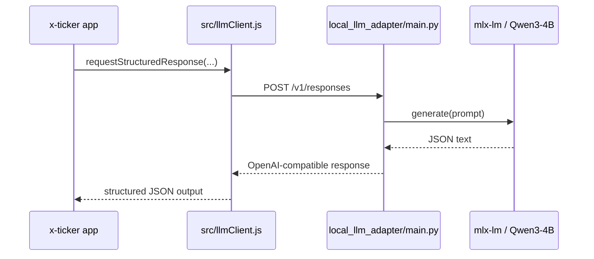

# Local Qwen3-4B on a Mac Mini using an OpenAI-compatible adapter

## Goal

Run the existing extractor and advisor flows against a local Qwen model on Apple Silicon without rewriting the app to a new inference protocol.

## Recommended stack

- Model runtime: `mlx-lm`
- Model family: `Qwen3-4B`
- App integration: OpenAI-compatible local HTTP adapter that exposes `POST /v1/responses`

## Why this shape

The current app already expects an OpenAI-style Responses API for:

- claim extraction
- the portfolio-aware advisor

So the simplest local path is:

1. keep the app's existing request shape
2. run a local adapter on the Mac Mini
3. point `OPENAI_BASE_URL` or `LOCAL_LLM_BASE_URL` at the adapter



## Suggested env vars

```bash
LLM_PROVIDER=local_openai_compatible
LOCAL_LLM_BASE_URL=http://127.0.0.1:8001/v1
LOCAL_LLM_API_KEY=local-dev-token
LOCAL_LLM_MODEL=qwen3-4b-local
OPENAI_MODEL=qwen3-4b-local
FINANCIAL_ADVISOR_MODEL=qwen3-4b-local
```

## Rollout order

1. advisor first
2. extraction in shadow mode
3. default local mode only after evals pass

## Files in this repo

- `src/llmClient.js`: shared Responses API client
- `local_llm_adapter/main.py`: local adapter stub for MLX-LM + Qwen3
- `scripts/start-local-qwen-adapter.sh`: convenience launcher
- `src/modelEvalHarness.js`: repeated governance and JSON-reliability evals for model-only testing
- `data/model-eval-suite.json`: scenario cases for product-fit reasoning checks

## Smoke test vs real evaluation

A successful `curl /v1/responses` smoke test only proves:

- the adapter is reachable
- the model can generate text
- the endpoint shape is compatible enough for the client

It does **not** prove that the model is suitable for this product. For that, run the evals below.

## Recommended evaluation commands

Run the combined local-model eval suite:

```bash
npm run evals:model
```

Run the same suite in strict mode:

```bash
npm run evals:model:strict
```

That command does two things:

1. runs repeated product-governance reasoning cases from `data/model-eval-suite.json`
2. runs the live extraction eval suite with cache disabled so you measure fresh model output

If you only want the extraction benchmark against the configured model:

```bash
npm run evals -- openai --live
```

## Monitoring while evals are running

The combined suite makes:

- `1` preflight `GET /v1/models`
- `21` reasoning `POST /v1/responses` calls by default
- `3` extraction `POST /v1/responses` calls for the live extraction eval

So if you only saw a handful of requests, the run is probably still in progress.

You can inspect the adapter status in another terminal:

```bash
curl -s http://127.0.0.1:8001/status
```

That endpoint now reports whether the model is loaded, how many requests are active, how many completed or failed, the last request duration, and the last error.

The adapter now also logs request start and finish events. If you want even noisier generation logs from `mlx-lm`, start it with:

```bash
LOCAL_LLM_VERBOSE=1 ./scripts/start-local-qwen-adapter.sh
```

## Operational notes

- start with non-thinking mode for reliable JSON
- keep heuristic fallbacks enabled
- measure extraction regressions before switching the default provider
